# Pagina Web
# Índice
# 1. Controllers
# 2. Assets
# 3. db
# 4. Models
# 5. Views

## 1. Controllers
Hay dos controlodares:                                             
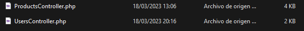
### 1.1 ProductsController
En este controlador de los productos. Contiene el código que permiten responder a las acciones que solicita la aplicación con relacion a los productos. Estan enlazados con las Views y los Models.
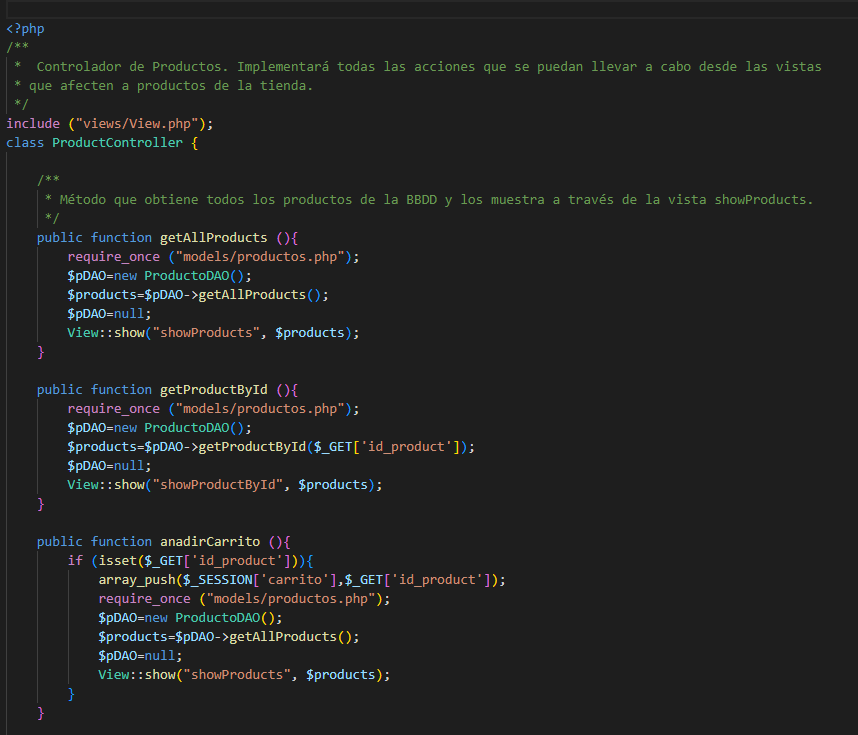
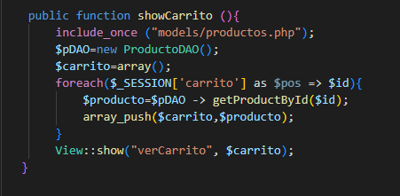
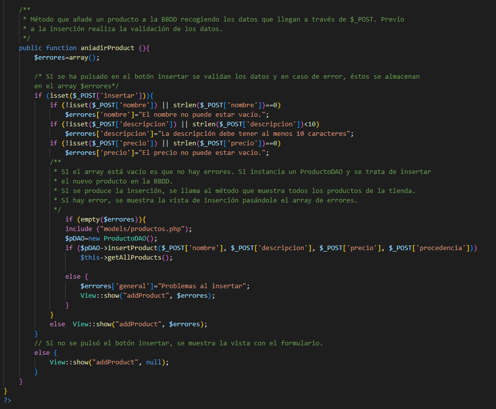
### 1.1 UsersController
En este controlador de los Usuarios. Contiene el codigo para controlar y validar el inicio de sesion. 
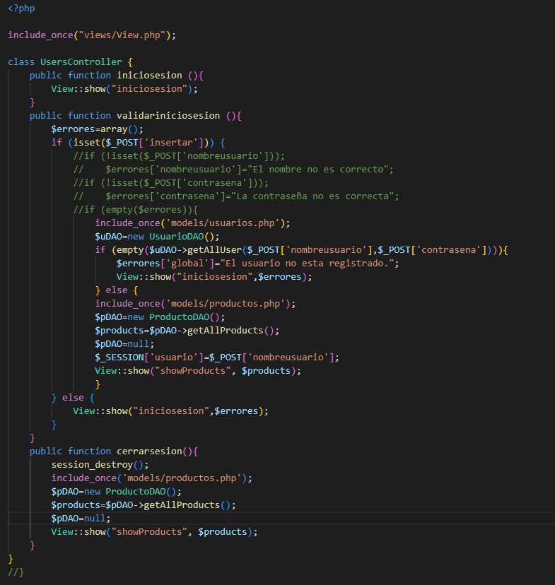
## 2. Assets
Carpeta que almacena todas las imagenes que son utilizadas por la base de datos para mostrarla en la aplicación.
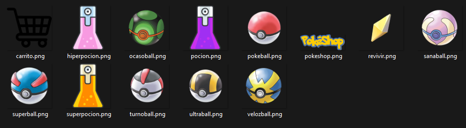
## 3. db
Se encarga de realizar la conexión con la base de datos
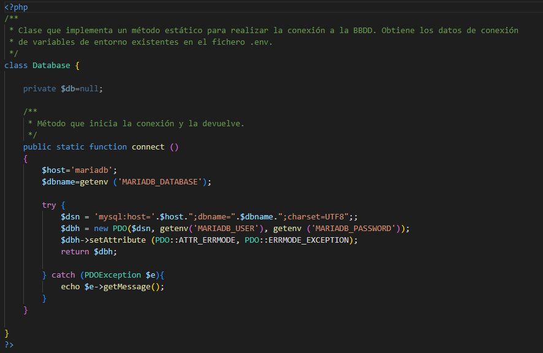
## 4. Models
Hay dos modelos:
Se encargan de trabajar con la base de datos y sacar toda la informacion de la base de datos que necesite la aplicación.
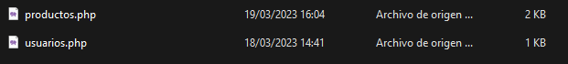
### 4.1 Productos
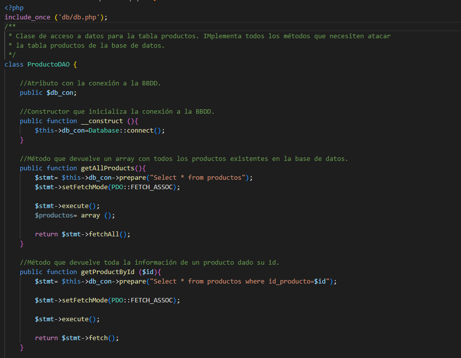
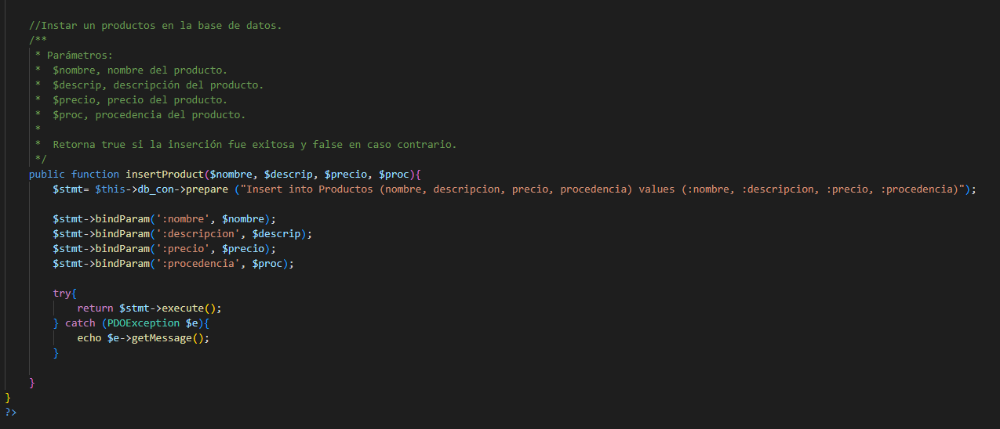
### 4.1 Usuarios
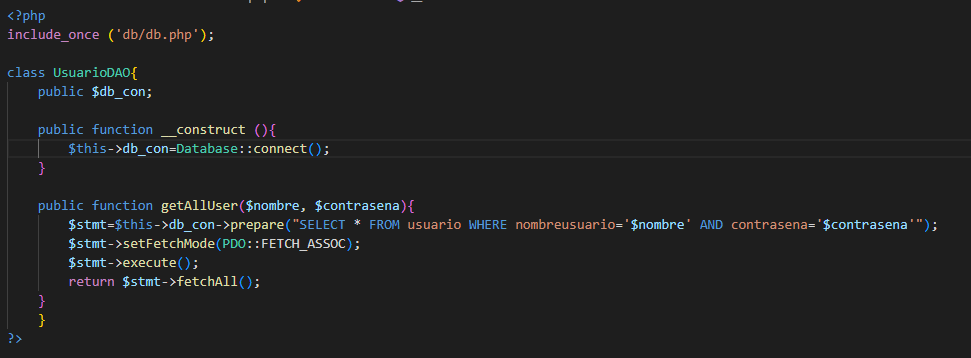
## 5. Views
Se encargan de mostrar todo el contenido de la aplicación web 
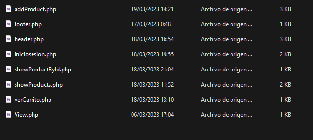
